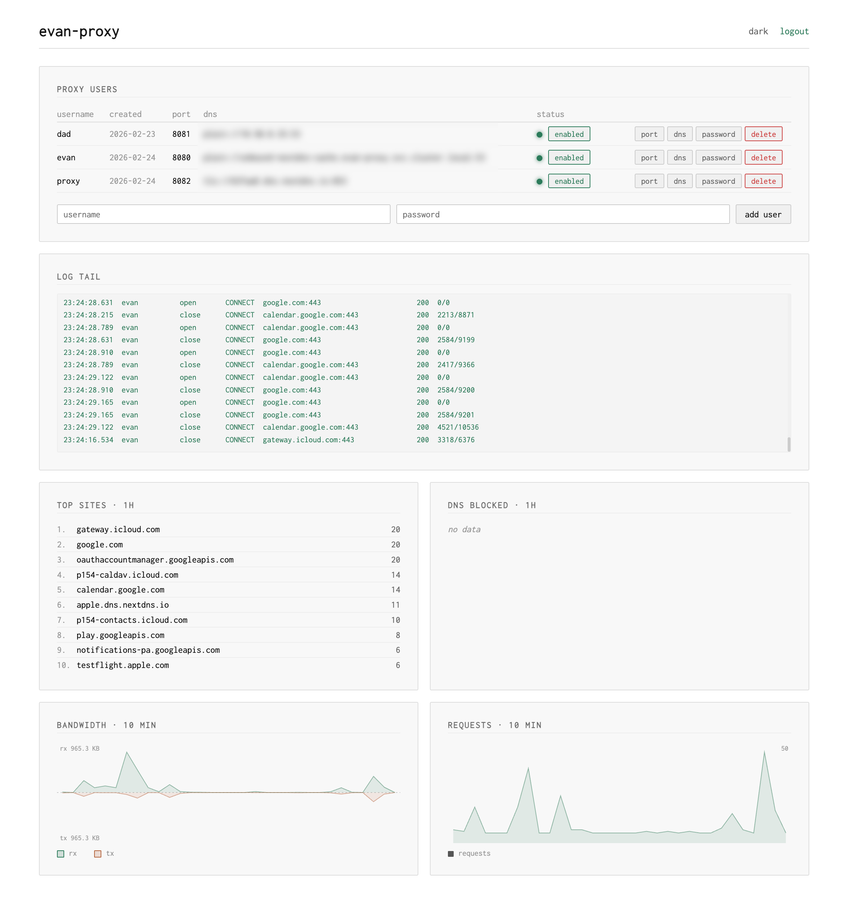

# evan-proxy

I built this proxy out of parental necessity.  I tried all of the prominent child web filtering solutions and they were all terrible and expensive.

All I wanted was to keep my kids away from harmful content and to be able to quickly turn internet on and off for them, but these services all required installing their sketchy MDM profile and using some crappy app.  I never knew what they were doing with my kids' info behind the scenes.

I knew I could do better.  

I would create my own MDM profile with the excellent and free [iMazing Profile Editor](https://imazing.com/profile-editor) and manage it through [SimpleMDM](https://simplemdm.com/).  I would use the profile to force my kids' phones through a proxy that I control.  I would use [NextDNS](https://nextdns.io/) (free tier) to filter out the apps and categories of websites that I didn't want them to visit. 
 
**The unsolved problem was the proxy server.**

There are a number of open-soruce proxy servers out there but none of them made it easy to turn on/off a single child's phone quickly and easily.  And none of them would let me easily set a unique DNS resolver for each child--my kids get different levels of restriction depending on their age.

**I decided to write evan-proxy.**   It's a simple and secure web proxy with per-child DNS server selection, authentication, and logging.

To make this work, follow this plan:

1. Set up *evan-proxy* on infrastructure of your choice. I run it on a homelab Kubernetes cluster and used the included Helm chart to install it, but you could easily run it on a single Raspberry Pi if you wanted.
2. Set up a user in the evan-proxy Admin UI for your child, with a [strong but easy](https://xkcd.com/936/) password.
3. Use the free and excellent [iMazing Profile Editor](https://imazing.com/profile-editor) to create a MDM profile for your child's Apple device.  
4. Configure the profile with a Global HTTP Proxy enforced.
5. Sign up for a DNS service like [NextDNS](https://nextdns.io/) and configure their DNS to your liking, blocking what you wish to block. 
6. Add that DNS server to the MDM profile to enforce its use.
7. Also, add that DNS server to the user's account in the evan-proxy Admin UI.
8. Sign up for a MDM service like [SimpleMDM](https://simplemdm.com/) to install and remotely maintain that profile.  This is what keeps your kid from reverting your restrictions.  Or, at least, it gives you a way to know when they've subverted them.
9. (optional) Set up a Prometheus dashboard to monitor proxy use and performance

## Features:
- HTTP and HTTPS (TLS) forward proxy with CONNECT tunnel support
- Per-user dedicated proxy ports with per-user DNS resolver selection
- Admin web UI for user management, live log streaming, and proxy enable/disable
- Helm chart for Kubernetes deployment
- Rate-limiting on authentication failures to prevent password brute-forcing
- DNS-over-TLS (DoT) and DNS-over-HTTPS (DoH) support
- DNS-level block detection (returns 523 for DNS-blocked domains)
- Downtime schedules — set per-user internet access windows by day of week, with support for multiple windows per day and overnight spans; temporary overrides let you suspend downtime for 15 minutes to 12 hours without changing the schedule
- Prometheus metrics on a dedicated internal listener (kept off the public admin port)

## Configuration

evan-proxy is configured via environment variables. All settings have sensible defaults except for admin credentials, which are required.

### Required

| Variable | Description |
|----------|-------------|
| `ADMIN_USER` | Admin interface username |
| `ADMIN_PASSWORD` | Admin interface password (bcrypt hash) |

Generate a bcrypt hash for the admin password:

```bash
htpasswd -nbBC 10 "" 'yourpassword' | cut -d: -f2
```

### Optional

| Variable | Default | Description |
|----------|---------|-------------|
| `PROXY_DB_PATH` | `/data/evan-proxy/users.db` | Path to SQLite user database |
| `ADMIN_LISTEN` | `:9090` | Admin interface listen address |
| `METRICS_LISTEN` | `127.0.0.1:9091` | Dedicated Prometheus metrics listen address. Empty string mounts `/metrics` on the admin port instead (legacy). |
| `METRICS_USER_LABEL` | `false` | When `true`, include a per-user label on `evanproxy_requests_total`. This is PII (usernames) — leave off unless you accept exposing usernames to Prometheus. |
| `DNS_SERVER` | | Custom DNS resolver (e.g. `1.1.1.1:53`), empty uses system default |
| `DNS_PROTOCOL` | `plain` | DNS protocol: `plain`, `tls` (DoT), or `https` (DoH) |
| `USER_PORT_MIN` | `8081` | First per-user dedicated proxy port |
| `USER_PORT_MAX` | `8090` | Last per-user dedicated proxy port |
| `AUTH_RETRY_TIMEOUT` | `5s` | Time to hold connection open for iOS 407 auth retry |
| `CONNECT_DIAL_TIMEOUT` | `10s` | Timeout for dialing target hosts |
| `IDLE_TIMEOUT` | `300s` | TCP idle connection timeout |
| `HTTP_TIMEOUT` | `30s` | HTTP response timeout |
| `AUTH_FAIL_RATE_LIMIT` | `5` | Failed auth attempts before rate limiting kicks in |
| `AUTH_FAIL_WINDOW` | `60s` | Sliding window for rate limiting |
| `LOG_FORMAT` | `human` | Log format: `json` or `human` |
| `LOG_HEADERS` | `false` | When `true`, log per-request headers on the plain-HTTP forward path: inbound headers, which hop-by-hop headers were stripped, and the exact headers forwarded upstream. Diagnostic only — verbose, and credentials are redacted. HTTPS (`CONNECT`) traffic is an opaque TCP tunnel whose headers are never inspected or modified. |
| `TZ` | | IANA timezone for downtime schedules (e.g. `America/Denver`) |
| `PAC_ENABLED` | `false` | Serve a PAC file on the proxy port at `PAC_PATH` |
| `PAC_PATH` | `/proxy.pac` | Request path the PAC is served at |
| `PAC_PROXY_ENDPOINT` | | Proxy `host:port` the PAC hands back; empty = echo the request's own `Host` (works for NAT/port-forward with no per-user config) |
| `PAC_BYPASS_DOMAINS` | `venmo.com,paypal.com,paypalobjects.com,braintreegateway.com,braintree-api.com` | Comma-separated domain suffixes routed `DIRECT` (bypassing the proxy) |

## Excluding sites from the proxy (PAC)

iOS's MDM **Manual** Global HTTP Proxy sends *everything* through the proxy with no bypass list. Some native apps (e.g. Venmo) gate login on device/risk signals that break when routed through a proxy, even though the same site works fine in the browser. To let specific domains bypass the proxy, switch the device to an **Auto** Global HTTP Proxy backed by a PAC file.

Set `PAC_ENABLED=true` to have the proxy answer an unauthenticated `GET PAC_PATH` on each proxy port. Because it's served on the proxy port itself, the PAC URL is simply the endpoint the device already uses:

```
http://<proxy-host>:<proxy-port>/proxy.pac
```

The PAC routes `PAC_BYPASS_DOMAINS` `DIRECT` and everything else back through the same proxy endpoint. By default that endpoint is the request's own `Host` — i.e. the exact `host:port` the device used to fetch the PAC — so NAT/port-forward setups need no per-user configuration (set `PAC_PROXY_ENDPOINT` only to override).

In the child's MDM profile, set the Global HTTP Proxy to **Auto** and point `ProxyPACURL` at that URL. (iOS fetches the PAC directly, not through the proxy, so the URL must be reachable off-proxy — which it is, since it's the same endpoint the device already reaches.)

**Security:** a PAC contains only routing rules — hostnames and the proxy `host:port`. It never contains credentials, so the endpoint is safe to expose unauthenticated. Proxy authentication is unchanged: iOS still sends the Basic proxy password (from the MDM profile) directly to the proxy on the 407 challenge. Note that domains routed `DIRECT` are **not** filtered or logged.

## Downtime Schedules

Each user can have a downtime schedule that blocks proxy access during specified hours on each day of the week. Schedules are configured through the admin UI using your local time (e.g. "no internet from 9:00 PM to 7:00 AM on school nights").

You can add multiple downtime windows per day — for example, block access during school hours (8 AM–3 PM) and again at bedtime (9 PM–7 AM). Overnight windows that cross midnight are handled automatically — a window from 21:00 to 07:00 on Monday means access is blocked from Monday 9 PM through Tuesday 7 AM.

**Temporary overrides.** When a user is currently in downtime, the admin UI shows an "override" button that lets you temporarily re-enable proxy access for a chosen duration (15 minutes to 12 hours). The override suppresses all scheduled downtime until it expires — even if a new downtime window starts during the override period. Active overrides display a countdown in the UI and can be cancelled at any time.

**Timezone configuration is required.** The server evaluates downtime schedules against its local clock, so it must be set to your timezone. In Kubernetes, set the `TZ` environment variable (the Docker image includes `tzdata`). The Helm chart exposes this as the `timezone` value:

```yaml
# values.yaml
timezone: "America/Denver"   # IANA timezone, e.g. America/Los_Angeles, US/Eastern
```

Without this, the container defaults to UTC and downtime windows won't match your local time.

## Metrics

Prometheus metrics are served at `/metrics` on a **dedicated internal listener**, separate from the admin port. By default that listener binds `127.0.0.1:9091` (`METRICS_LISTEN`), so metrics are never reachable on the public admin host. Setting `METRICS_LISTEN=""` falls back to mounting `/metrics` on the admin port (legacy behaviour).

The per-user label on `evanproxy_requests_total` is **off by default** because usernames are PII. The metric is labelled only by `method` and `status_code` unless you set `METRICS_USER_LABEL=true`.

The unauthenticated `net/http/pprof` debug endpoints (`/debug/pprof/*`) share this internal listener too, so process profiles are never exposed on the public admin host. With the legacy `METRICS_LISTEN=""` they fall back to the admin port alongside `/metrics`.

In Kubernetes the pod binds the metrics listener on `0.0.0.0:9091` and exposes it **only** through an internal `ClusterIP` Service (`<release>-evan-proxy-metrics`) — never the public `LoadBalancer`. A NetworkPolicy rule restricts scraping to the namespace named by `metrics.scrapeNamespace` (default `monitoring`). Point Prometheus at that ClusterIP Service (e.g. a `ServiceMonitor` targeting the `metrics` port) rather than the proxy's public IP.

## Building

```bash
make build    # or: CGO_ENABLED=0 go build -ldflags="-s -w" -o evan-proxy ./cmd/evan-proxy
```

## Docker

```bash
make docker   # or: docker buildx build -t ghcr.io/chrissnell/evan-proxy:dev .
```

## Helm Chart

The Helm chart is in `helm/evan-proxy/`.

### Install

```bash
helm install evan-proxy ./helm/evan-proxy -f my-values.yaml
```

### Values

| Key | Type | Default | Description |
|-----|------|---------|-------------|
| `replicaCount` | int | `1` | Number of replicas |
| `image.repository` | string | `"ghcr.io/chrissnell/evan-proxy"` | Container image repository |
| `image.tag` | string | `"0.1.5"` | Container image tag |
| `image.pullPolicy` | string | `"IfNotPresent"` | Image pull policy |
| `imagePullSecrets` | list | `[{name: ghcr-secret}]` | Image pull secrets |
| `proxy.logFormat` | string | `"human"` | Log format: `json` or `human` |
| `proxy.idleTimeout` | string | `"300s"` | TCP idle connection timeout |
| `proxy.httpTimeout` | string | `"30s"` | HTTP response timeout |
| `proxy.connectDialTimeout` | string | `"10s"` | Timeout for dialing target hosts |
| `proxy.authRetryTimeout` | string | `"5s"` | Time to hold connection for iOS 407 retry |
| `proxy.authFailRateLimit` | int | `5` | Failed auth attempts before rate limiting |
| `proxy.authFailWindow` | string | `"60s"` | Sliding window for rate limiting |
| `proxy.dnsServer` | string | `""` | Custom DNS resolver, empty uses system default |
| `proxy.dnsProtocol` | string | `""` | DNS protocol: `plain`, `tls`, or `https` (empty = plain) |
| `proxy.userPortMin` | int | `8080` | First per-user dedicated proxy port |
| `proxy.userPortMax` | int | `8090` | Last per-user dedicated proxy port |
| `metrics.listen` | string | `"0.0.0.0:9091"` | In-pod metrics listen address (bind `0.0.0.0` so the ClusterIP Service can reach it) |
| `metrics.port` | int | `9091` | Port for the internal metrics ClusterIP Service |
| `metrics.userLabel` | bool | `false` | Include the per-user (PII) label on request metrics |
| `metrics.scrapeNamespace` | string | `"monitoring"` | Namespace allowed to scrape metrics by the NetworkPolicy |
| `admin.listen` | string | `":9090"` | Admin interface listen address |
| `admin.user` | string | `"admin"` | Admin username |
| `admin.passwordHash` | string | `"$2y$10$CHANGEME"` | Admin password as bcrypt hash |
| `existingSecret` | string | `""` | Use a pre-created Secret instead of generating one. Must contain keys: `ADMIN_USER`, `ADMIN_PASSWORD` |
| `persistence.enabled` | bool | `true` | Enable persistent storage for SQLite database |
| `persistence.size` | string | `"1Gi"` | PVC size |
| `persistence.storageClass` | string | `""` | StorageClass (empty = default) |
| `service.type` | string | `"LoadBalancer"` | Kubernetes service type |
| `service.loadBalancerIP` | string | `""` | Static IP from MetalLB pool |
| `service.annotations` | object | `{}` | Service annotations |
| `service.adminPort` | int | `9090` | Service port for admin interface |
| `ingress.enabled` | bool | `false` | Enable ingress (e.g. for admin UI) |
| `ingress.className` | string | `""` | Ingress class name |
| `ingress.hosts` | list | | Ingress host rules |
| `resources.requests.cpu` | string | `"100m"` | CPU request |
| `resources.requests.memory` | string | `"64Mi"` | Memory request |
| `resources.limits.cpu` | string | `"1000m"` | CPU limit |
| `resources.limits.memory` | string | `"512Mi"` | Memory limit |
| `timezone` | string | `"America/Denver"` | IANA timezone for downtime schedule evaluation |
| `networkPolicy.enabled` | bool | `true` | Enable Kubernetes NetworkPolicy |
| `networkPolicy.allowAllEgress` | bool | `true` | Allow all egress for CONNECT tunnels |
| `nodeSelector` | object | `{}` | Node selector |
| `tolerations` | list | `[]` | Tolerations |
| `affinity` | object | `{}` | Affinity rules |

Per-user proxy ports (`userPortMin` through `userPortMax`) are automatically exposed on both the deployment and the service. Each user is assigned a dedicated port via the admin UI.
